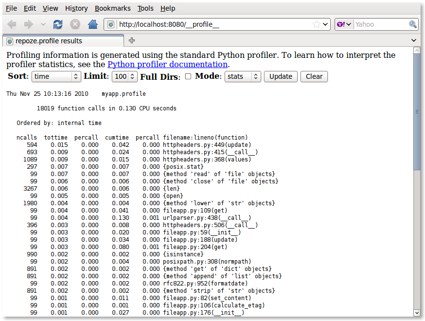

:mod:`repoze.profile` Documentation
===================================

This package provides a WSGI middleware component which aggregates
profiling data across *all* requests to the WSGI application.  It
provides a web GUI for viewing profiling data.

Installation
------------

Install using setuptools, e.g. (within a virtualenv)::

 $ easy_install repoze.profile

Configuration via Python
------------------------

Wire up the middleware in your application::

 from repoze.profile import ProfileMiddleware
 middleware = ProfileMiddleware(
                app,
                log_filename='/foo/bar.log',
                cachegrind_filename='/foo/cachegrind.out.bar',
                discard_first_request=True,
                flush_at_shutdown=True,
                path='/__profile__',
                unwind=False,
               )

The configuration options are as follows::

 - ``log_filename`` is the name of the file to which the accumulated
   profiler statistics are logged.

 - ``cachegrind_filename`` is the optional name of the file to which
   the accumulated profiler statistics are logged in the KCachegrind
   format.

 - If ``discard_first_request`` to true (the default), then the
   middleware discards the statistics for the first request:  the
   rationale is that there are a bunch of lazy / "first time"
   initializations which distort measurement of the application's
   normal performance.

 - If ``flush_at_shutdown`` is true (the default), profiling data will
   be deleted when the middleware instance disappears (via its
   __del__).  If it's false, profiling data will not be deleted.

 - ``path`` is the URL path to the profiler UI.  It defaults to
   ``/__profile__``.

 - ``unwind`` is a configuration flag which indicates whether the app_iter
   returned by the downstream application should unwound and its results read
   into memory.  Setting this to true is useful for applications which use
   generators or other iterables to do "real work" that you'd like to
   profile, at the expense of consuming a lot of memory if you hit a URL
   which returns a lot of data.  It defaults to false.

Configuration via Paste
-----------------------

Wire the middleware into a pipeline in your Paste configuration, for
example::

 [filter:profile]
 use = egg:repoze.profile
 log_filename = myapp.profile
 cachegrind_filename = cachegrind.out.myapp
 discard_first_request = true
 path = /__profile__
 flush_at_shutdown = true
 unwind = false
 ...

 [pipeline:main]
 pipeline = egg:Paste#cgitb
            egg:Paste#httpexceptions
            profile
            myapp

Viewing the Profile Statistics
------------------------------

As you exercise your application, the profiler collects statistics about
the functions or methods which are called, including timings.  Please see
the `Python profilers documentation
<http://docs.python.org/library/profile.html>`_  for an explanation of the
data which the profiler gathers.

Once you have some profiling data, you can visit the configured ``path``
in your browser to see a user interface displaying profiling statistics
(e.g. ``http://localhost:8080/__profile__``).

Profiling individual functions
------------------------------

Sometimes it might be needed to profile a specific function, be it for
analyzing a bottleneck found with the full profiling, or to compare different
approaches to the same problem. This package provides a decorator for this
case. To use it, simply decorate the desired function like this::

.. code-block:: python

from repoze.profile.decorator import profile

@profile('Descriptive title', sort_columns=('time', 'cumtime'), lines=30)
my_bottleneck()
    # some really time consuming code
    ...

The results of the profiling will be sent to standard out. The ``title`` will
appear at the top of the results, for guidance. All other arguments are
optional. ``sort_columns`` allows specifying the columns to sort the timing
results. See the Python profilers documentation for available options. ``lines``
is the number of lines of results to print. Default is 20. Zero means no limit.

Reporting Bugs / Development Versions
-------------------------------------

Visit https://github.com/repoze/repoze.profile/ to report bugs.  Fork
the repository to submit patches as pull requests.

.. toctree::
   :maxdepth: 2

Indices and tables
==================

* :ref:`genindex`
* :ref:`modindex`
* :ref:`search`

